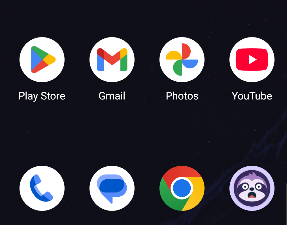
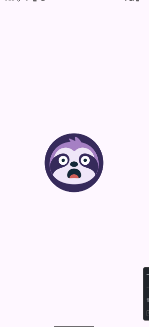
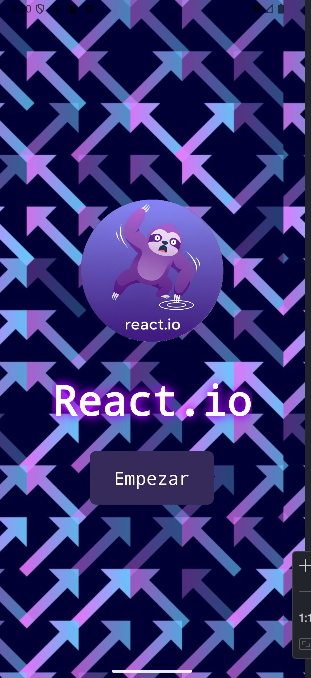
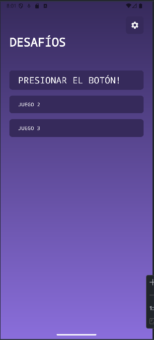
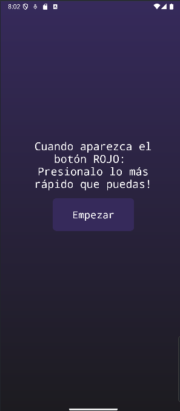
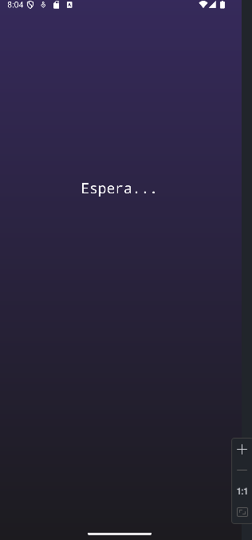
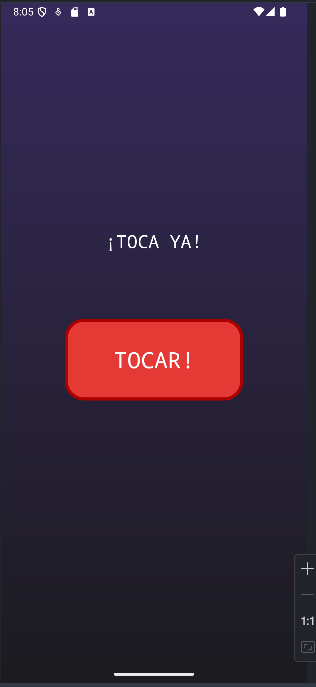
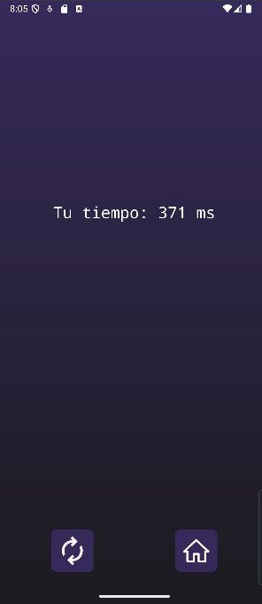
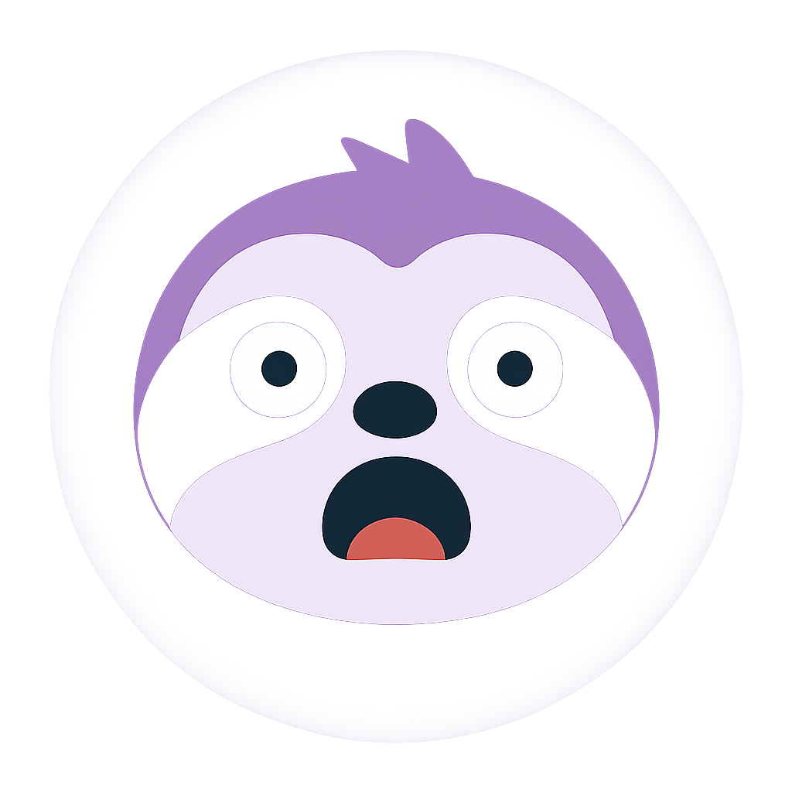

# REACT.IO - Minijuegos de reacción

## Objetivo
Desarrollar una aplicación Android utilizando Java que incluya múltiples pantallas, buenas prácticas e interacción con el usuario.

**Repositorio**:  [parcial-1-am-acn4a-bernardez-ruiz](https://github.com/chill0101/parcial-1-am-acn4a-bernardez-ruiz)

**Figma design**: [React.io](https://www.figma.com/design/O3DEPG0oeuGvc0kWW7WCsN/React-io)

---

## Descripción del Proyecto

**React.io** es una aplicación Android de minijuegos diseñada para entrenar y medir los tiempos de reacción del usuario. La app ofrece diferentes desafíos de velocidad en una interfaz moderna.

## Equipo
- **Bernardez Lucas** 
- **Ruiz Lucas**

## Funcionalidades Implementadas

### Pantallas Principales
1. **MainActivity** - Pantalla de bienvenida con logo y background en loop
2. **GameMenuActivity** - Menú de selección de juegos
3. **ReactionGameActivity** - Primer juego prototipo de tiempo de reacción
4. **InDevelopmentActivity** - Pantalla para juegos en desarrollo, se utiliza al seleccionar juegos no implementados

### Juego 1: "PRESIONAR EL BOTÓN!"
- **Objetivo**: Medir el tiempo de reacción al presionar un botón rojo. Sirve como primer prototipo funcional, luego se implementarán más juegos y más funcionalidades.
- **Mecánica**: 
  - El usuario presiona "Empezar"
  - Después de un delay aleatorio (2-5 segundos), aparece un botón rojo
  - El usuario debe presionarlo lo más rápido posible
  - Se muestra el tiempo de reacción en milisegundos

## Cumplimiento de Requisitos Técnicos

### Desarrollo Mínimo Obligatorio (para el 4)
- **ConstraintLayout**: Implementado en [`activity_reaction_game.xml`](app/src/main/res/layout/activity_reaction_game.xml)
- **LinearLayout**: Usado en [`activity_main.xml`](app/src/main/res/layout/activity_main.xml) y [`activity_game_menu.xml`](app/src/main/res/layout/activity_game_menu.xml)
- **Button**: Múltiples botones implementados con events con click (tap)
- **TextView**: Textos informativos y resultados
- **Contenido realista**: UI con imágenes y textos coherentes
- **Eventos**: Click listeners en botones de navegación y en el juego al presionar el botón rojo, calculando el tiempo de reacción y mostrándolo en pantalla
- **Elementos dinámicos**: Creación y manipulación de vistas usando Java

### Características Avanzadas (para el 10 :v)
- **Organización de recursos**:
  - Strings en [`strings.xml`](app/src/main/res/values/strings.xml)
  - Dimensiones en [`dimens.xml`](app/src/main/res/values/dimens.xml)  
  - Colores en [`colors.xml`](app/src/main/res/values/colors.xml)
- **Diseño visual**: Paleta de colores púrpura con efectos neon
- **Comportamiento dinámico**: 
  - Animaciones de fondo en loop (no es la dinámica principal pero aporta al diseño)
  - Cambios de visibilidad de elementos según el estado del juego
  - Cálculo y display de tiempos de reacción en tiempo real
- **Navegación fluida**: Sistema de navegación entre actividades
- **Conventional commits**: Uso de mensajes claros y descriptivos en los commits del repositorio :p
- **Capturas de pantalla y descripción**: Documentación en este README con imágenes y explicación del flujo de usuario

## UX + Diseño

### Paleta de Colores
```xml
<color name="lazyPurple">#362A5B</color>
<color name="darkerPurple">#1C1B1F</color>
<color name="lightPurple">#8A6EDB</color>
<color name="tap_button_red">#E53935</color>
```

### Efectos Visuales
- Gradientes de fondo personalizados
- Efectos de texto con sombra y glow (neón)
- Animaciones de fondo en loop horizontal
- Mensajes para el usuario con feedback visual


## Flujo de Usuario

1. **Inicio**: Pantalla principal con logo y botón "Empezar"
2. **Menú**: Selección entre 3 juegos (solo el primero funcional por ahora)
3. **Juego de Reacción**:
   - Lectura de instrucciones
   - Presionar "Empezar" 
   - Esperar la señal visual (aparición del botón rojo)
   - Tocar el botón rojo lo más rápido posible
   - Ver resultado en milisegundos
   - Opción de reintentar o volver al menú
4. **Juegos en desarrollo**: Pantalla informativa con navegación de regreso

## Estructura del Proyecto

### Actividades
- [`MainActivity`](app/src/main/java/com/example/react_io/MainActivity.java): Pantalla inicial con animaciones
- [`GameMenuActivity`](app/src/main/java/com/example/react_io/GameMenuActivity.java): Menú de juegos
- [`ReactionGameActivity`](app/src/main/java/com/example/react_io/ReactionGameActivity.java): Lógica del juego principal
- [`InDevelopmentActivity`](app/src/main/java/com/example/react_io/InDevelopmentActivity.java): Placeholder para futuros juegos

### Recursos Organizados
- **Layouts**: Diseños XML con ConstraintLayout y LinearLayout
- **Drawables**: Fondos gradientes, formas de botones, iconos vectoriales
- **Values**: Strings, colores, dimensiones organizados por categorías


## Instalación y Ejecución
1. Clonar el repositorio
2. Abrir en Android Studio
3. Sincronizar el proyecto con Gradle
4. Ejecutar en emulador / dispositivo Android

---


## Informe Detallado por Pantalla (consigna)

### 0. Icono de la App






### 1. MainActivity - Pantalla de Bienvenida

**Propósito**: Pantalla inicial que da la bienvenida al usuario y presenta el logo de la aplicación.

**Funcionalidades**:
- Mostrar logo de React.io con efectos visuales
- Animación de fondo en loop horizontal para crear ambiente dinámico
- Botón "Empezar" para navegar al menú principal
- Introducción visual al estilo de la app

**Flujo de Uso**:
1. El usuario abre la aplicación
2. Se presenta el logo con animación de fondo
3. El usuario lee "React.io - Minijuegos de reacción"
4. El usuario toca "Empezar" para continuar
5. Navegación automática a GameMenuActivity

**Elementos UI**:
- TextView con logo estilizado
- TextView con subtítulo descriptivo
- Button principal de navegación
- LinearLayout con fondo animado
- Gradientes púrpura como fondo




**MainActivity - Pantalla de Bienvenida**

---

### 2. GameMenuActivity - Menú de Selección

**Propósito**: Menú que permite al usuario elegir entre los diferentes juegos ofrecidos :D

**Funcionalidades**:
- Presentar opciones de juegos claramente diferenciadas
- Navegación hacia el juego seleccionado o pantalla de desarrollo
- Diseño intuitivo con iconografía clara

**Flujo de Uso**:
1. El usuario llega desde `MainActivity`
2. Se presentan 3 botones de juegos (actualmente):
   - Juego "PRESIONAR EL BOTÓN!" (funcional)
   - Juego "Juego 2" (en desarrollo)
   - Juego "Juego 3" (en desarrollo)
3. El usuario selecciona una opción
4. Si elige el primer juego → va a `ReactionGameActivity`
5. Si elige juegos 2 o 3 → va a `InDevelopmentActivity`

**Elementos UI**:
- 3 `Button` principales para selección de juegos
- `TextView` de título "DESAFÍOS"
- `LinearLayout` vertical para organización
- Iconografía consistente con el tema gaming



**GameMenuActivity - Menú de Selección**  

---

### 3. ReactionGameActivity - Juego Principal

**Propósito**: Implementar el primer prototipo de juego - medir tiempo de reacción del usuario.

**Funcionalidades**:
- Sistema de medición precisa de tiempo de reacción
- Lógica de juego con delay aleatorio (2-5 segundos)
- Feedback visual inmediato al usuario
- `Button` Opción de reintentar y `Button` volver al menú
- Cálculo y display de resultados en milisegundos

**Flujo de Uso Detallado**:
1. **Estado Inicial**: 
   - Se muestran las instrucciones del juego
   - `Button` "Empezar" visible
   - Mensaje: "Presiona empezar y espera a que aparezca el botón rojo"

2. **Estado de Espera**:
   - Usuario presiona `Button` "Empezar"
   - Se inicia timer interno aleatorio (2-5 seg)
   - Mensaje cambia a "Espera..." 
   - `Button` "Empezar" se oculta

3. **Estado de Reacción**:
   - Aparece `Button` rojo grande
   - Se inicia medición de tiempo
   - Mensaje: "¡PRESIONA AHORA!"
   - Usuario debe tocar lo más rápido posible el `Button` rojo

4. **Estado de Resultado**:
   - Se calcula y muestra tiempo en ms
   - Mensaje: "Tu tiempo: XXX ms"
   - Aparecen `Button` "Reintentar" y `Button` "Volver al menú"
   - Feedback visual según el rendimiento

**Elementos UI Dinámicos**:
- `Button` "Empezar" (se oculta/muestra según estado)
- `Button` rojo de reacción (creado dinámicamente)
- `TextView` de instrucciones (cambia según estado del juego)
- `TextView` de resultados (muestra tiempo calculado)
- `Button` "Reintentar" y "Volver al menú" (aparecen al final)

**Lógica de Programación**:
- Uso de Handler y Runnable para delays
- `System.currentTimeMillis()` para medición precisa en clase Java
- Estados del juego controlados por variables booleanas
- Manipulación dinámica de visibilidad de elementos

#### ReactionGameActivity - Estados del Juego



**Estado Inicial - Instrucciones**


**Estado de Espera**



**Estado de Acción**



**Estado de Resultado**

---

### 4. InDevelopmentActivity - Pantalla de Desarrollo

**Propósito**: Informar al usuario sobre funcionalidades futuras y mantener navegación fluida. Es solamente una pantalla informativa.

**Funcionalidades**:
- Comunicar el estado de desarrollo
- Mantener la experiencia de usuario sin errores
- Ofrecer navegación de regreso como única opción
- Preparar espacio para futuros juegos

**Flujo de Uso**:
1. Usuario llega desde `GameMenuActivity` al seleccionar juego no implementado
2. Se muestra mensaje informativo: "Este juego está en desarrollo"
3. Se explica que próximamente estará disponible
4. Usuario puede usar `Button` "Volver al Menú"
5. Navegación de regreso a `GameMenuActivity`

**Elementos UI**:
- `TextView` principal con mensaje informativo
- `TextView` secundario con descripción adicional
- `Button` de navegación "Volver al Menú"
- Diseño consistente con el resto de la app y un perezoso de chill pero laborioso


**InDevelopmentActivity - En Desarrollo**

---

## Mockup

**Herramienta utilizada**: Figma  
**Link al diseño**: [React.io Figma Design](https://www.figma.com/design/O3DEPG0oeuGvc0kWW7WCsN/React-io)

El mockup incluye:
- Wireframes de las 4 pantallas principales
- Paleta de colores definida:
  - #362A5B lazyPurple
  - #1C1B1F darkerPurple
  - #8A6EDB lightPurple
  - #E53935 tap_button_red
  - #C62828 tap_button_red_pressed
  - #AA0000 tap_button_border 
- Estados de botones y elementos interactivos
- Flujo de navegación visual
- Especificaciones de tipografía y espaciado
---


## Muchas gracias por el tiempo dedicado a revisar el proyecto! 